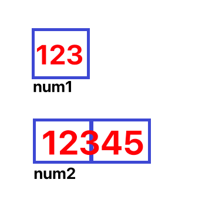
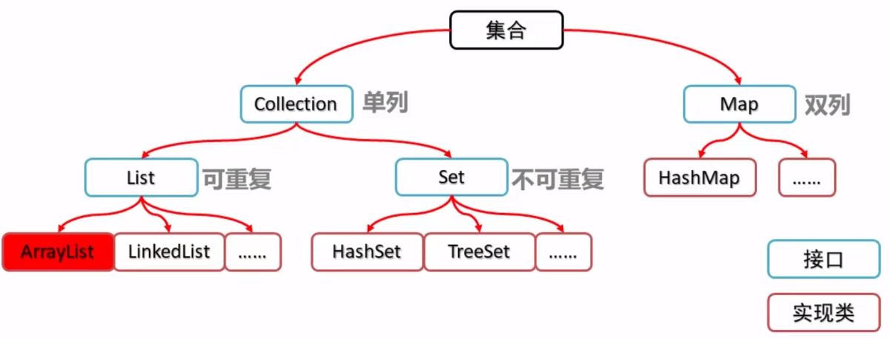
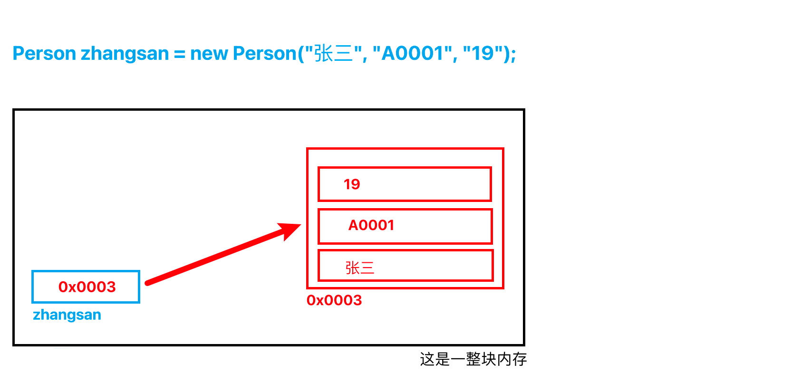

# 基本类型（字面量）


[Java文档：Primitive Data Types](https://docs.oracle.com/javase/tutorial/java/nutsandbolts/datatypes.html)


### 基础类型分类及其特性

| 类型名称     | 关键字  | 占用内存 | 取值范围                                   |
| ------------ | ------- | -------- | ------------------------------------------ |
| 字节型       | byte    | 1 字节   | -128~127                                   |
| 短整型       | short   | 2 字节   | -32768~32767                               |
| 整型         | int     | 4 字节   | -2147483648~2147483647                     |
| 长整型       | long    | 8 字节   | -9223372036854775808L~9223372036854775807L |
| 单精度浮点型 | float   | 4 字节   | +/-3.4E+38F（6~7 个有效位）                |
| 双精度浮点型 | double  | 8 字节   | +/-1.8E+308 (15 个有效位）                 |
| 字符型       | char    | 2 字节   | ISO 单一字符集                             |
| 布尔型       | boolean | 1 字节   | true 或 false                              |

上述这些基础数据类型，又叫==字面量==（literal），是由字母、数字等构成的字符或者数值，她只能作为右值（等号右边的值）。


### 常用的基本类型

1）==int==：常用于计数器、年龄等需要整数表示的地方。比如我们要写一个for循环，里面需要操作第几个元素的时候，这个“几”的值我们就可以用int类型的变量接收。

2）==long==：常用于ID。比如我们需要记录员工ID的时候，就可以用long类型来进行接收。

3）==boolean==：常用来存储布尔判断的结果。比如判断一个人是否为成年人，就可以输出true/false这样的结果。

4）==double==：常用来存储小数值。注意，金融计算或者其他高精度业务场景，请慎重使用double，可以考虑使用String等类型。

5）==char==：常用来分割字符串。比如要将  “Hi”  分割成   'H'    'i'    。


### 内存模型

变量就是申请内存来存储值。也就是说，当创建变量的时候，需要在内存中申请空间。

但是不同类型的变量，所需要申请的内存大小也不一样。

当我们在执行下面两行代码的时候，内存中是什么样的？

```java
private byte  num1 = 123;
private short num2 = 12345;
```

byte类型的变量，JVM会申请1个字节长度的内存空间，并将该空间命名为“num1”，然后继续往该内存中写入值“123”。

short类型的变量，JVM会申请2个字节长度的内存空间，并将该空间命名为“num2”，然后继续往该内存中写入值“12345”。

如下图示：



### 注意事项

声明变量的时候，一定要注意变量的**取值范围**，防止出现**内存溢出**。什么是内存溢出呢，就是这块内存只能装比如1字节的信息，但是却写进去2个字节的信息。就比如我们一个杯子只能装500mL的水，我们却要往里面装入1000mL的水，水杯就会被灌满且水会溢出来。

为什么会导致内存溢出呢？因为我们在声明一个变量的时候，一定是带有类型的。在声明变量的时候，JVM就会向计算机申请一个内存空间。那这个内存空间该给多大？JVM根据变量的**类型**来进行区分，这就是不同类型的数据占用不同内存大小的原因。**不同类型的变量/数据占用不同内存空间的原因在于：更高效地使用内存、防止内存浪费。**

如果我们仅申请了1个字节长度（byte类型）的内存，但是往里面写入了2个字节长度的值，那么就会导致这个值的一部分信息丢失。打个比方：我们要把一根20cm的棍子装入10cm的包装盒里，那么计算机只会**截取**这根棍子的一半装到盒子里，剩余没装进去的直接丢掉。这样我们下次打开盒子的时候就误以为这根棍子只有10cm长，实际上他原来是20cm的。这会导致什么结果呢？

比如我们声明一个byte类型的变量，但是赋予的值却是128，那么就会导致IDEA报错。虽然IDEA已经很聪明，但是并不意味着这行代码本身就不可以执行（写入的128后读出来肯定不是128），只是IDEA帮我们看出来了这个明显的错误并提前终止代码执行，防止导致更多的错误。在我们以后的开发过程中，很多变量在执行过程中的值是不断变化的，我们需要考虑更多的业务场景来判断所使用的类型是否合适，确保这个变量是否能装得下我们需要存储的全部数据。这种运行时发生的错误IDEA很可能检查不出来，要稍加注意。


# 复杂类型（引用类型）

在Java中，引用类型的变量非常类似于C/C++的指针。等号右边的变量值是一个对象（Object），等号左边的变量本身保存的是对象的地址（或称为指针）。


### 指针概述

指针可以简单理解成是一个唯一的字符串。把一个国家比喻成是一整块内存，每个居民是一块块不同大小的内存空间。那么每个居民的身份证号码就是指针，因为身份证号码不仅具有唯一性，我们还可以根据号码找到一个唯一的人，身份证号码和对应的人是双向唯一的。专业的讲，指针就是物理地址经过哈希算法后输出的字符串。

==所有引用类型的默认值都是null==，读取该类型变量值的时候一定要做空值判断，否则会引起报错。


### 常用的复杂类型

1）**String**：常用于人物的name，部分业务场景的价格、金额也用字符串表示。

2）**Array**：常用于存储一组数据，比如一个小组的所有成员的信息。

3）**Collection**（单列集合）：

​      3.1）**List**：特点是元素有索引，元素可重复。例如存储法外狂徒张三的购物记录。

​			   3.1.2）**ArrayList**：存取有序，查询快，增删慢。常用于：增删改少、查多的业务场景，比如张三名下有多少个手机号码。

​			   3.1.2）**LinkedList**：存取有序，查询慢，增删快。常用于：增删改多、查少的业务场景。

​      3.2）**Set**：特点是元素不可重复。如要统计张三都买过啥，就要对张三购物车进行去重（第二声）。

4）**Map**（双列集合）：以 `key-value` 或叫 `健值对` 的形式出现就叫双列啦～

3）**泛型**：自己定义的类型，这可就多得去了，数不胜数，所以叫“范”型，超级超级超级广泛的类型。
      比如：根据Person类new一个张三，那么实例 张三 就是Person类型。根据Student类new一个李四...




### 内存模型

当我们在执行下面两行代码的时候，内存中是什么样的？

```java
Person zhangsan = new Person("张三", "A0001", "19");  // 假设实例的名字叫张三，学号是A0001，19岁。
```

上面这行代码，我们从左往右读可以简单地理解成：我现在要（1）声明一个Person类型的变量，（2）这个变量的名字叫做zhangsan，这个变量 ***指向***（3）新创建（new）的一个Person类的实例，这个实例（4）初始化的信息有 "张三"、"A0001"、"19" 这几个。

简单地讲，当执行上面这行代码的时候，JVM会向内存申请2块内存。一块内存的值为实例的信息，"张三"、"A0001"、"19" 这些信息就存在这里，这块内存的地址例如为0x0001。另一块名为zhangsan的内存，存储的值为0x0001。有点绕对吧？看下面的图：



就像去快递柜取包裹一样。输入的是取件码，拿到的是包裹。我们不是直接拿到包裹，而是需要分2步走：输入取件码、拿包裹。


