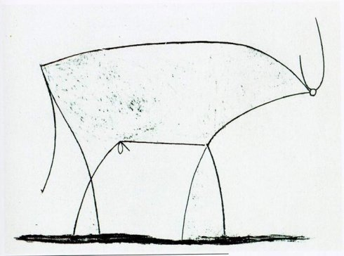

# 面向对象浅谈


[Java官方文档：What Is an Object?](https://docs.oracle.com/javase/tutorial/java/concepts/object.html)


### 抽象思想

面向对象思想是通过对我们这个世界的事物进行抽象后所得出的结果。

现在，我们先来欣赏毕加索画的一幅抽象画，来感受一下什么是抽象：




我们可以看出画家把一头生动丰富的牛，去除了很多元素，仅保留了牛的若干最基本的 ***特征*** 。这些特征包括：牛有一个头、两支角、一个身体、四条腿、一条尾巴和一个不可描述的东西。因此我们还可以感受到：抽象过程，就是把物体的 基本特征 **提纯** 出来的过程。


### 面向对象思想

现在，我们试想如何将这头牛从另一个角度进行抽象：

**情景1:** 

如果我们要把这头牛拉到菜市场去卖，会如何跟卖家介绍呢？

我会说：“老板，这是一头水牛，重350斤，还能拉货。”

上面的一番话，其实已经在对所要出售的水牛进行抽象了。首先，我们提取出了牛的品种（水牛），其次我们提取出了牛的体重（350斤），最后我们还提取出了牛能拉货。我们再次对上述特征进行整理，得出牛的2类重要特征：

- 属性：品种、体重。
- 行为：拉货。

当然，如果从别的角度来抽象，可能得出其他类型的特征。但是在面向对象编程的抽象过程中，我们最关心的是 ==属性==（方法）和 ==行为== 这两个特征。

==从面向对象编程的视角出发，我们可以对现实世界中的所有事物进行抽象，进而提取出事物的状态和行为。==

经过抽象后：==一个物体一般通过声明一个类来实现。这个类的属性（状态）一般通过声明一些 ***变量*** 来实现，这个类的行为一般通过一些 ***函数*** 来实现。==

水牛，首先是一头牛，然后才是一头水牛。我们来将这头牛用代码实现：

**第一步**：创建一个牛的类

```java
public class Cattle {

    /**
     * 属性：品种、体重。
     */
    private String breed;
    private String weight;

    public Cattle(String breed, String weight) {
        this.breed = breed;
        this.weight = weight;
    }

    /**
     * 行为：拉货。
     */
    public void hauling() {
        System.out.println("我可以拉货～");
    }

}
```

**第二步**：创建一个水牛实例

```java
Cattle buffalo = new Cattle("水牛","250斤");
buffalo.hauling();  // -> 我可以拉货～
```

照此，我们还可以创建出奶牛、黄牛...蒙牛？？😄


### 封装思想

面向对象的三个特点就是：封装、继承、多态。（这句话我背的hh）我们这里不谈继承和多态。

如果把类比喻成一个袋子，那么它的属性和方法就装在类这个袋子里。简单的说，一个类就是一个封装了数据（属性）以及操作这些数据的逻辑代码（方法）。

在一个类内部，某些代码或某些数据可以是私有（private）的，不能被外界访问。通过这种方式，类可以把自己的数据和方法只让可信的类或者对象操作，对不可信的进行信息隐藏。

如果你学过JavaScript，就会发现，JS通常使用对象来实现一头牛或一个学生等对实体进行抽象。当然后面JS也有Class了，这个是后话。相较JS而言，Java是一门完全面向对象的语言，规范又清晰。JavaScript蹭Java热度不说，语言本身也是乱糟糟。


